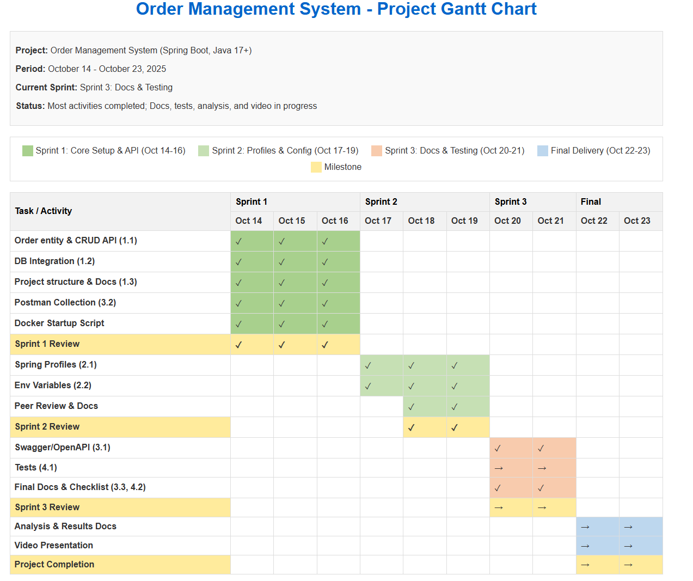

# Project Roadmap

---
**File:** Roadmap.md
**Purpose:** Outlines objectives, milestones, and timeline for the Order Management System backend API project. Maintained for tracking progress and team alignment.
---

## Sprint Progress
Sprint 1: Completed
Sprint 2: Completed
Sprint 3: In progress

## Objectives

### General Objective
Restore and enhance the reliability of MELI's order management system by restructuring its backend using Spring Boot, implementing robust environment configurations, comprehensive API documentation, and automated testing to prevent future failures.

### Specific Objectives
1. Analyze and resolve technical failures in the order management system.
2. Design and implement a Spring Boot-based backend for order processing.
3. Establish environment-specific configurations and secure variable management.
4. Document the API using Swagger/OpenAPI and provide detailed usage instructions.
5. Implement comprehensive unit and integration tests.
6. Ensure smooth deployment and reproducibility using Docker and startup scripts.
7. Facilitate team learning by documenting key decisions and changes.

## Timeline and Milestones

### Sprint 1 (October 14-16, 2025)
- Implement Order entity and CRUD REST API (User Story 1)
- Integrate database (PostgreSQL)
- Establish project structure following Spring Boot best practices

### Sprint 2 (October 17-19, 2025)
- Configure environment-specific profiles and system variables (User Story 3)
- Document environment management and switching profiles
- Ensure no sensitive data is committed

### Sprint 3 (October 20-21, 2025)
- Integrate Swagger/OpenAPI documentation (User Story 2)
- Update README with API usage and endpoint details
- Create Postman collection for API endpoints

### Final Delivery (October 22-23, 2025)
- Deploy service to Render (User Story 4)
- Document deployment process and troubleshooting steps
- Implement health check endpoint and monitoring instructions (User Story 5)
- Write and run unit/integration tests
- Document test results and final requirements checklist

## Deliverables

### Sprint 1
- Order entity and CRUD REST API implemented
- Database integration
- Project structure following Spring Boot best practices

### Sprint 2
- Environment-specific configuration files and system variable setup
- Documentation for environment management and switching profiles

### Sprint 3
- Swagger/OpenAPI documentation integrated
- README updated with API usage and endpoints
- Postman collection for API endpoints

## Activity Breakdown & Estimates

| Activity | Stage | Estimated Hours | Role |
|----------|-------|----------------|------|
| Design Order entity & CRUD API | Sprint 1 | 4 | Backend Developer |
| Database integration (H2/PostgreSQL) | Sprint 1 | 4 | Backend Developer |
| Project structure setup | Sprint 1 | 2 | Backend Developer |
| Environment profiles & variables | Sprint 2 | 3 | DevOps Engineer |
| Environment documentation | Sprint 2 | 2 | DevOps Engineer |
| Swagger/OpenAPI integration | Sprint 3 | 2 | Backend Developer |
| README & API docs | Sprint 3 | 2 | Backend Developer |
| Postman collection | Sprint 3 | 2 | QA Engineer |
| Deployment to Render | Final | 3 | Deployment Engineer |
| Deployment docs & troubleshooting | Final | 2 | Deployment Engineer |
| Health check endpoint | Final | 2 | Backend Developer |
| Unit/integration tests | Final | 4 | QA Engineer |
| Test results & checklist | Final | 1 | QA Engineer |

## Budget Estimate

| Role                | Hourly Rate (USD) | Estimated Hours | Subtotal (USD) |
|---------------------|------------------:|---------------:|---------------:|
| Backend Developer   | 50.00             | 16             | 800.00         |
| DevOps Engineer     | 55.00             | 5              | 275.00         |
| QA Engineer         | 40.00             | 7              | 280.00         |
| Deployment Engineer | 45.00             | 5              | 225.00         |
| Total               | 47.88 (avg)       | 33             | 1,580.00       |

## Project Progress

As of October 19, 2025, the following has been accomplished:
- Order entity and CRUD REST API: Complete
- Database integration (H2/PostgreSQL): Complete
- Project structure: Complete
- Spring profiles and environment variables: Complete
- Swagger/OpenAPI documentation: Complete
- README and API usage docs: Complete
- Postman collection: Complete
- Deployment to Render: Complete
- Health check endpoint: Complete
- Unit/integration tests: In progress
- Monitoring and requirements checklist: Complete
- Final analysis & results docs: Not started
- Video presentation: Not started

See `Project-Completion-Checklist.md` for a detailed, up-to-date checklist.

## Project Gantt Chart

## Technologies and Tools
- Java 17+: Backend programming language
- Spring Boot 3.x: Backend framework
- PostgreSQL: Production database
- H2: Development database
- Docker: Containerization and deployment
- Swagger/OpenAPI: API documentation and testing
- Postman: API endpoint testing
- JUnit: Unit and integration testing
- GitHub: Version control and collaboration

## Stakeholders
- Juan Ventura: Tech Transformation Manager (project sponsor)
- Arturo Bandini: Lead backend developer (solution implementer)
- MELI Operations Team: End users of the order management system
- Digital NAO Team: QA and stakeholders for final review

## Risk Management

| Risk | Impact | Probability | Mitigation Strategy |
|------|--------|------------|---------------------|
| Incorrect environment configuration | High | Medium | Use profiles, automate config validation, peer reviews |
| Database connectivity issues | High | Medium | Use robust connection pooling, fallback configs, logging |
| Incomplete or outdated API documentation | Medium | Medium | Integrate Swagger, enforce doc updates in PR reviews |
| Security of environment variables | High | Medium | Use .env files, avoid hardcoding, restrict repo access |
| Test coverage gaps | Medium | Medium | Use checklists, enforce test writing in workflow |
| Docker/containerization issues | Medium | Low | Test locally, provide clear startup scripts and docs |
| Team knowledge loss | Medium | Low | Maintain change logs and decision documentation |
